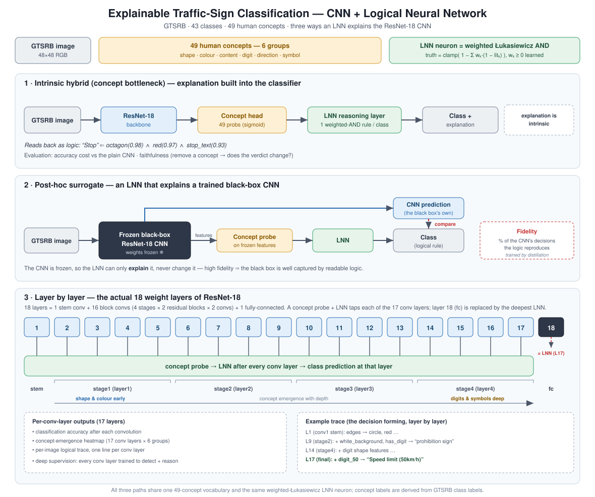

# Explainable Traffic-Sign Classification with a CNN + Logical Neural Network

A neuro-symbolic image classifier that makes a CNN's decisions **readable**.

A convolutional network acts as a *perception front end* that detects
human-understandable **concepts** in a traffic sign (its shape, colour, and
content — digits, arrows, pictograms, stripes). A **Logical Neural Network
(LNN)** layer then reasons over those concepts with weighted logical rules and
outputs a class *together with an explicit logical explanation*, e.g.:

> Classified as **"Stop"** (truth = 0.96) because: `octagon` (0.98) AND `red`
> (0.97) AND `symbol_stop_text` (0.93).

This directly implements the project brief: a CNN concept detector coupled to a
logical reasoning layer, evaluated on a public image dataset against a
conventional CNN baseline, measuring both **classification accuracy** and the
**quality/faithfulness of the explanations**. The dataset is the **German
Traffic Sign Recognition Benchmark (GTSRB)** — 43 classes — chosen because
traffic signs have a strict visual grammar that maps cleanly onto concepts.

The CNN is a **ResNet-18** (torchvision, ImageNet-pretrained by default).

### Three ways the LNN explains the CNN

The core question is *how an LNN helps explain a CNN*. This project answers it
from three angles:

1. **Intrinsic (concept-bottleneck).** The LNN *is* the classifier's reasoning
   head: CNN → concepts → LNN → class. Every decision is a logical rule by
   construction. Measured by accuracy vs the baseline and by **faithfulness**
   (concept interventions).
2. **Post-hoc surrogate.** Take a *trained, ordinary black-box CNN* and fit an
   LNN over a human-concept probe of its features, trained (by knowledge
   distillation) to **reproduce the CNN's own predictions**. The headline metric
   is **fidelity** — the fraction of the CNN's decisions the logical rules
   reproduce — a direct measure of how much of the black box the LNN explains.
3. **Layer by layer.** ResNet-18 has **18 weight layers** (1 stem conv + 16 block
   convs + 1 fc). A concept probe + LNN reasoner is attached after **each of the
   17 convolutional layers** (the 18th, `fc`, is replaced by the deepest LNN).
   This exposes, after every convolution: which concepts the network has
   detected, and what class its logic concludes — so you can watch the decision
   *form* as information flows through the CNN, and see low-level concepts
   (shape, colour) emerge in early layers and fine ones (specific digits/symbols)
   only in deep layers.

---

## Why traffic signs (and how concepts are labelled)

Generic datasets need hand-annotated concept labels. Traffic signs don't: every
one of the 43 GTSRB classes is *defined* by a small set of visual concepts, so
we derive **ground-truth concept labels directly from the class label**
(see [`src/concepts.py`](src/concepts.py)). There are **49 concepts** in six
readable groups:

| Group | Concepts |
|-------|----------|
| shape | circle, triangle_up, triangle_down, diamond, octagon |
| colour | red, blue, yellow, grey, white_background |
| content | has_digit, has_arrow, has_symbol, has_stripe |
| digit | digit_20 … digit_120 |
| direction | dir_right, dir_left, dir_straight, … , dir_roundabout |
| symbol | symbol_two_cars, symbol_truck, symbol_stop_text, symbol_pedestrian, … |

The concept vector of every class is **unique** (verified on import), so the
logic layer can in principle recover the class purely from concepts. Print the
full table with:

```bash
python run.py concepts
```

---

## Architecture



The core intrinsic pipeline:

```
image ─► CNN backbone ─► concept head ─► concept probabilities  p ∈ [0,1]^49
                                              │
                                              ▼
                                   LNN reasoning layer
                        (one weighted Łukasiewicz AND-neuron per class)
                                              │
                                              ▼
                              per-class truth values ─► argmax ─► class + explanation
```

- **CNN backbone** ([`src/models/backbone.py`](src/models/backbone.py)) —
  **ResNet-18** (`ResNet18Backbone`, the main architecture, ImageNet-pretrained
  by default and exposing per-stage features), or a compact `CNNBackbone`
  fallback for fast CPU runs. Selected via `backbone:` in `config.yaml`.
- **Concept head** — a linear + sigmoid layer producing 49 concept
  probabilities. This is the "perception front end", supervised with the
  ground-truth concepts (a *Concept Bottleneck*).
- **LNN reasoning layer** ([`src/models/lnn_layer.py`](src/models/lnn_layer.py)) —
  each class is a single **weighted Łukasiewicz conjunction neuron** with
  learnable, non-negative importance weights:

  ```
  literal_k = p_k        if concept k defines the class
            = 1 - p_k    otherwise   (a NOT literal)
  truth_c   = clamp( bias_c − Σ_k w_{c,k}·(1 − literal_k),  0, 1 )
  ```

  This is the semantics of an LNN neuron (Riegel et al., 2020, *Logical Neural
  Networks*): each violated literal subtracts its weight, giving the "how much
  does breaking this rule hurt" reading that makes the decision interpretable.
  It is pure PyTorch and fully differentiable, so the whole CNN→LNN pipeline
  trains end-to-end.

- **Baseline** ([`src/models/baseline.py`](src/models/baseline.py)) — the *same*
  backbone with a plain 43-way linear classifier, so the comparison isolates the
  effect of the concept-bottleneck + logic head. This is also the **black box**
  the post-hoc surrogate explains.

- **Post-hoc LNN surrogate** ([`src/models/surrogate.py`](src/models/surrogate.py))
  — *freezes* the trained baseline CNN, reads its features through a trainable
  concept probe, and reasons with an LNN trained to mimic the CNN's predictions.
  Because the black box is frozen, the surrogate can only *explain* it, never
  change it. Reports **fidelity** (agreement with the CNN), surrogate accuracy,
  and the CNN's own accuracy.

- **Layer-wise ResNet+LNN** ([`src/models/layerwise.py`](src/models/layerwise.py))
  — a ResNet-18 with a concept probe + LNN reasoner after each of its **17
  convolutional layers** (forward hooks tap `conv1` and the 16 block convs;
  `resnet18_weight_layers()` lists all 18), trained with deep supervision. Yields
  per-conv-layer concept F1 (a *concept emergence* map), per-layer accuracy (how
  much of the decision is settled after each convolution), and per-image
  **layer-by-layer logical traces**.

> **IBM LNN library.** The core reasoner is implemented directly so the project
> has no fragile dependency. An **optional** bridge to IBM's official `lnn`
> package for *pure symbolic* inference is in [`src/symbolic.py`](src/symbolic.py)
> (enable by uncommenting `lnn` in `requirements.txt`).

---

## Setup

```bash
python -m venv .venv
# Windows:  .venv\Scripts\activate
# Linux/Mac: source .venv/bin/activate
pip install -r requirements.txt
```

GTSRB (~190 MB) downloads automatically to `./data` on first run.

Requires Python 3.9+, PyTorch 2.1+, torchvision 0.16+ (torchvision ships the
`GTSRB` dataset).

### GPU (NVIDIA / CUDA)

Training and inference run on an NVIDIA GPU automatically when a CUDA build of
PyTorch is installed — the device defaults to `auto` (CUDA if available, else
CPU). Check what PyTorch sees:

```bash
python run.py device
```

If it reports a CPU-only build, install the CUDA wheels:

```bash
pip install torch torchvision --index-url https://download.pytorch.org/whl/cu124
```

On a GPU the pipeline additionally uses **mixed precision (AMP)**, **cuDNN
autotuning**, and **pinned-memory** transfers for speed. Controls:

- `--device auto|cuda|cuda:0|cpu` (or `device:` in `config.yaml`) — force a device.
- `--no-amp` (or `amp: false`) — disable mixed precision.

Every `train-*` / `evaluate` run prints the device it is using (e.g.
`[hybrid] device: cuda:0 (NVIDIA RTX ...)  | AMP on`). Everything is
device-agnostic, so the same commands run unchanged on CPU or GPU.

---

## Configuration (`config.yaml`)

`config.yaml` is the editable list of defaults for a run (data paths, backbone,
epochs, learning rate, device, output dir, …).

**When it is created.** It already ships in the repo — nothing generates it, and
you never *have* to create one. You only touch it to change a default permanently
(e.g. always train for 8 epochs, or force `device: cpu`). If the file is deleted
or missing, the code silently falls back to the built-in defaults in
[`src/utils.py`](src/utils.py) (the `Config` dataclass), so runs still work.

**When it is loaded.** Every `train-*`, `evaluate`, and `explain` command loads
it automatically — the `--config` flag *defaults to* `config.yaml`, so you don't
need to type it. (Point `--config other.yaml` at a different file to use another
preset.) The `concepts` and `device` commands don't read it.

**Precedence** (later wins):

1. built-in defaults (`src/utils.py`) →
2. values in `config.yaml` (loaded at launch, never modified by the code) →
3. CLI flags (`--epochs`, `--subset`, `--device`, …) for one-off overrides.

So: edit `config.yaml` for a change you want every run to use; pass a flag for a
one-off tweak.

---

## Usage

All commands go through [`run.py`](run.py). Settings come from
[`config.yaml`](config.yaml) (loaded by default) and can be overridden with flags.

**Quick smoke test** (a few minutes on CPU — compact backbone, 5 % of the data,
2 epochs):

```bash
python run.py train-hybrid   --backbone simple --epochs 2 --subset 0.05
python run.py train-baseline --backbone simple --epochs 2 --subset 0.05
python run.py evaluate       --subset 0.05
```

**Full run** (recommended; use a GPU or expect a longer CPU run):

```bash
python run.py train-hybrid    --config config.yaml   # intrinsic CNN+LNN
python run.py train-baseline  --config config.yaml   # plain black-box CNN
python run.py train-surrogate --config config.yaml   # LNN that explains the black box
python run.py train-layerwise --config config.yaml   # ResNet-18 + LNN, explainable layer-by-layer
python run.py evaluate        --config config.yaml   # report + figures + fidelity + layers + metrics
```

`train-surrogate` requires a trained `outputs/baseline.pt`; `evaluate` folds in
the surrogate's fidelity and the layer-by-layer analysis automatically if
`outputs/surrogate.pt` / `outputs/layerwise.pt` exist.

To iterate fast on CPU, add `--backbone simple` (or `--no-pretrained`) and
`--subset 0.05 --epochs 2`.

**Inspect explanations for individual test images:**

```bash
python run.py explain --num 8                     # explain the intrinsic hybrid
python run.py explain --mode surrogate --num 8    # explain the black-box CNN's decisions
python run.py explain --mode layerwise --num 4    # layer-by-layer logical trace
```

Check GPU status any time with `python run.py device`.

Key flags: `--epochs N`, `--subset F` (fraction 0–1), `--batch-size N`,
`--backbone resnet18|simple`, `--no-pretrained`, `--small-input`,
`--device auto|cuda|cpu`, `--no-amp`, `--data-root PATH`, `--out-dir PATH`,
`--no-download`.

---

## What `evaluate` produces

Written to `./outputs/`:

- **`REPORT.md`** — hybrid vs baseline accuracy and the **accuracy cost** of the
  hybrid design, concept-detection accuracy / macro-F1, explanation faithfulness,
  the full **explanation-quality metric suite** (comprehensiveness & sufficiency,
  rule correctness, stability, simulatability, and the sanity-check verdict), the
  post-hoc surrogate's **fidelity** to the black-box CNN (with worked "CNN says X
  / LNN agrees because …" examples), the layer-by-layer analysis, sample
  explanation sentences, and the weakest-detected concepts.
- **`example_explanations.png`** — a grid of test signs, each annotated with the
  logical rule that fired (green = correct, red = wrong).
- **`layerwise_concept_emergence.png`** — heatmap of concept-detection F1 by
  ResNet conv layer (17 rows) × concept group (present when a layer-wise model is
  trained).
- **`evaluation.json`** — all metrics, machine-readable.

### Layer-by-layer explainability

When `outputs/layerwise.pt` exists, the report adds a section showing, for each
of the 17 convolutional layers: its classification accuracy (how much of the
decision is settled after that convolution), its concept macro-F1, the
concept-emergence table, and worked per-image traces of the form *"L1 (conv1
stem) detects circle, red; … L17 (stage4 block1 conv2) additionally detects
digit_50 → Speed limit (50km/h)"*. This is the direct answer to using an LNN to
make the CNN explainable **layer by layer**, at ResNet-18's true 18-layer depth.

### Explanation faithfulness (are the stated reasons the *real* reasons?)

A readable explanation is worthless if it isn't causal. We test this with a
**concept intervention** ([`src/explain.py`](src/explain.py)): for each
prediction we remove (set to 0) each concept the winning rule depends on and
measure how far the class truth value drops and whether the prediction flips. A
high truth-drop / flip-rate means the concepts named in the explanation are the
actual causes of the decision — a *faithful* explanation, not a post-hoc story.

### Explanation-quality metrics ([`src/metrics.py`](src/metrics.py))

`evaluate` also reports a suite of standard explainability metrics, grouped by
what they verify:

- **Faithfulness — comprehensiveness & sufficiency** (ERASER-style, adapted to
  concepts). Rank concepts by how much removing them changes the predicted-class
  probability, then measure the drop when the top-k are *removed*
  (comprehensiveness — higher is better) and when *only* the top-k are kept
  (sufficiency — closer to 0 is better).
- **Plausibility — rule correctness.** GTSRB gives us every class's ground-truth
  concept set, so we check whether the concepts the model detected match the
  predicted class's known rule: precision, recall, F1 and exact-rule-match, over
  all predictions and over correct predictions.
- **Robustness — explanation stability.** Perturb each image slightly
  (brightness + noise) and measure how often the prediction stays the same and
  the Jaccard overlap of the supporting-concept set across perturbations.
- **Simulatability.** Train a simple linear proxy to predict the *model's own
  prediction* from the concepts, and report held-out agreement (for binary,
  human-readable concepts and for soft probabilities). High agreement = the
  concept explanation is a sufficient basis to simulate the model.
- **Sanity-check control** (Adebayo et al. model-parameter randomization test).
  Randomize the LNN weights and confirm the metrics **collapse** (accuracy →
  chance, comprehensiveness and rule-correctness drop). If they don't, the
  explanations aren't tied to the learned logic. The report prints a
  PASSED/NOT-PASSED verdict.

All land in `REPORT.md` (section *Explanation-quality metrics*) and
`evaluation.json`.

---

## Results

Full run: **ImageNet-pretrained ResNet-18** on **full GTSRB** (26.6k train /
12.6k test), 8 epochs (surrogate 6), seed 0. Numbers are generated by `evaluate`
into `outputs/REPORT.md` / `outputs/evaluation.json` (never hard-coded).

| Aspect | Metric | Result |
|---|---|---|
| **Accuracy** | Plain CNN baseline | **97.59 %** |
| | Hybrid CNN+LNN | **96.88 %** |
| | Accuracy cost of interpretability | **0.71 pts** |
| **Concepts** | Concept detection macro-F1 | 96.13 % |
| **Faithfulness** | Comprehensiveness (↑ better) | 0.886 |
| | Sufficiency (↓ better) | 0.288 |
| | Concept-removal flip rate | 30.1 % |
| **Plausibility** | Rule correctness F1 / exact-match | 99.4 % / 95.9 % |
| **Robustness** | Stability: prediction / Jaccard | 99.7 % / 99.8 % |
| | Simulatability (binary concepts) | 98.9 % |
| **Black-box** | Surrogate **fidelity** to the CNN | 99.16 % |
| **Layer-by-layer** | Accuracy @ conv L1 / L9 / L17 | 14.3 % / 96.6 % / 97.4 % |
| **Sanity check** | Acc: trained → LNN-rand → +perception-rand | 96.7 % → 78.9 % → 3.9 % (**PASS**) |

Reading the headline story:

- The LNN reasoning head costs **< 1 pt** of accuracy versus the black-box CNN,
  yet every decision comes with a logical rule.
- The rules are **faithful** (comprehensiveness 0.886), **plausible** (they match
  the true GTSRB rules 99.4 % F1), **stable**, and **simulatable** (98.9 %).
- The post-hoc surrogate reproduces **99.16 %** of the plain CNN's decisions —
  i.e. an LNN can explain almost the entire black box.
- The layer-by-layer view shows the decision *forming with depth* (L1 ≈ chance →
  L9 ≈ 97 %).
- The sanity check **passes**: resetting the learned concept detector collapses
  accuracy to ≈ chance (3.9 %). Randomising only the LNN *weights* leaves 78.9 %,
  revealing how much is carried by the LNN's fixed rule *structure* (the GTSRB
  concept grammar) versus its learned weights.

Reproduce with the **Full run** commands above (seeded via `config.yaml`).

---

## Project layout

```
ImageClassifyCNNLNN/
├─ run.py                     # CLI: train-hybrid|baseline|surrogate|layerwise / evaluate / explain / concepts / device
├─ config.yaml                # all hyperparameters
├─ requirements.txt
├─ src/
│  ├─ concepts.py             # 49-concept vocabulary + class→concept ground truth
│  ├─ data.py                 # GTSRB loader that attaches concept labels
│  ├─ train.py                # training loops (hybrid + baseline + surrogate + layerwise)
│  ├─ evaluate.py             # accuracy, concept F1, faithfulness, fidelity, layers, report
│  ├─ explain.py              # readable explanations + intervention test + layer traces
│  ├─ metrics.py              # comprehensiveness/sufficiency, rule correctness, stability
│  ├─ symbolic.py             # optional IBM-LNN symbolic inference bridge
│  ├─ utils.py                # config, seeding, device, io
│  └─ models/
│     ├─ backbone.py          # ResNet-18 (+ per-stage features) and compact CNN
│     ├─ lnn_layer.py         # differentiable LNN reasoning layer
│     ├─ hybrid.py            # CNN + LNN hybrid (intrinsic)
│     ├─ baseline.py          # plain CNN (also the black box to explain)
│     ├─ surrogate.py         # post-hoc LNN surrogate of the black-box CNN
│     └─ layerwise.py         # ResNet-18 with an LNN at every stage (layer-by-layer)
├─ tests/test_pipeline.py     # fast, data-free unit tests
└─ outputs/                   # checkpoints, report, figures (generated)
```

---

## Tests

Fast unit tests (no data download, CPU-only) covering: concept-vector
uniqueness, that the LNN recovers the class from ground-truth concepts,
tensor shapes/ranges, gradient flow through the logic layer, the ResNet-18
backbone's per-stage features, that the layer-wise model taps exactly the 17
conv layers (`resnet18_weight_layers()` returns 18), the surrogate's frozen
teacher, and the explanation + all explanation-quality-metric APIs:

```bash
pip install pytest
pytest -q
```

---

## Notes & limitations

- Concepts are derived from class labels, so concept *accuracy* is an upper bound
  on how well the front end can localise each visual concept; the interesting
  measurements are the accuracy cost vs the baseline and explanation
  faithfulness.
- The default ResNet-18 downloads ImageNet weights (~45 MB) on first use and is
  best trained on a GPU. On a CPU, use `--backbone simple` and/or
  `--no-pretrained --subset 0.1` for quick iteration; expect longer full runs.
- The layer-wise concept-emergence pattern (low-level concepts early, fine
  concepts late) only becomes clear after real training — it is noise on an
  under-trained model.
- Reproducibility: a fixed seed (`config.yaml`) seeds Python, NumPy and PyTorch.
